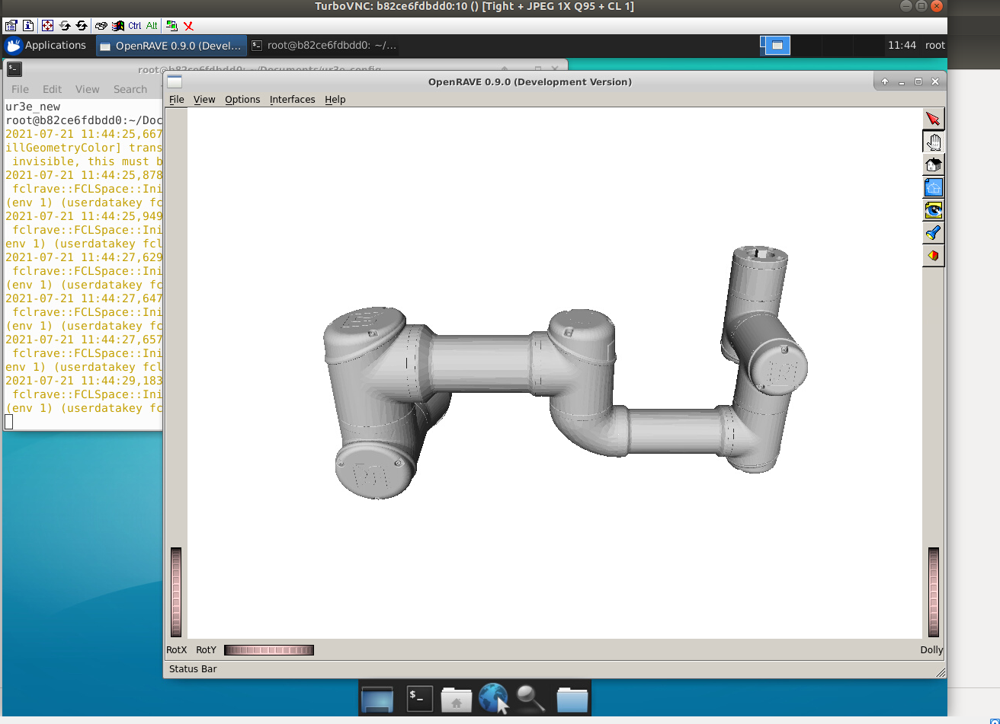

IKFast Kinematics Solver
========================

In this section, we will walk through configuring an IKFast plugin for MoveIt (altered for hubraum purposes).

What is IKFast?
---------------

IKFast, the Robot Kinematics Compiler, is a powerful inverse kinematics solver provided within Rosen Diankov's `OpenRAVE <http://openrave.org>`_ motion planning software. IKFast automatically analyses any complex kinematic chain for common patterns that allow for an analytic solution and generates C++ code to find them.
As a consequence, IKFast provides extremely stable solutions that can be found in a few microseconds on recent processors.

MoveIt IKFast
---------------

MoveIt provides tools to generate an IKFast kinematics plugin for MoveIt using the OpenRAVE generated cpp files.
This tutorial will step you through setting up your robot to utilize the power of IKFast.
MoveIt IKFast is tested on ROS Melodic with a 6DOF and 7DOF robot arm manipulator.
While it works in theory, MoveIt IKFast doesn't currently support >7 degree of freedom arms.

Getting Started
-----------------
If you haven't already done so, make sure you've completed the steps in `Getting Started <../getting_started/getting_started.html>`_.

You should have a MoveIt configuration package for your robot that was created by using the `Setup Assistant <../setup_assistant/setup_assistant_tutorial.html>`_.

OpenRAVE is a planning framework as complex as MoveIt itself and installing it is tricky -- particularly because its public documentation is not maintained anymore.
Fortunately, personalrobotics provide a `docker image <https://hub.docker.com/r/personalrobotics/ros-openrave>`_ based on Ubuntu 14.04 with OpenRAVE 0.9.0 and ROS Indigo installed, which can be used to generate the solver code once.

So the easiest way to run the IKFast code generator is through this docker image.
For manual building instructions (tailored towards Ubuntu 16.04), please see the `Kinetic version of this tutorial <http://docs.ros.org/kinetic/api/moveit_tutorials/html/doc/ikfast/ikfast_tutorial.html>`_.
To follow the recommended, docker-based approach, ensure you have docker installed and started: ::

 sudo apt-get install docker.io
 sudo service docker start

The following command will ensure that you can run docker with your user account (adding $USER to the docker group): ::

 sudo usermod -a -G docker $USER

You need to log off/log on in order to actually activate this permission change.

  Note: To run docker from `WSL2 <https://docs.microsoft.com/en-us/windows/wsl/install-win10>`_, you need to install the `Docker Desktop WSL 2 backend <https://docs.docker.com/docker-for-windows/wsl>`_.

[hubraum note]
  Note:  Be aware, that X11 servers do not allow 3D accelerated graphics forwarding. Thus in later part of this tutorial look for TurboVNC (or VirtualGL) installation tutorial in order to preview openrave generated model of your device. However it is only neccessary if you want to play more with GUI applications assosiated with MoveIT and IKFast environment (like RViz). For sole generation of dedicated kinematics, you might omit this part.
 
Install the MoveIt IKFast package either from Debian packages or from source.

**Binary Install**: ::

 sudo apt-get install ros-${ROS_DISTRO}-moveit-kinematics

**Source**

Inside your catkin workspace's ``./src`` directory: ::

 git clone https://github.com/ros-planning/moveit.git
 rosdep install -y --from-paths . --ignore-src --rosdistro ${ROS_DISTRO}
 catkin build

Creating the IKFast MoveIt plugin
---------------------------------

To facilitate copy-and-paste, we suggest to define the robot name as an environment variable: ::

  export MYROBOT_NAME="ur3e"
  export MYROBOT_CONFIG_OUTPUT_PATH="root/$MYROBOT_NAME_config/"

Getting UR calibration 
----------------------

Package for extracting the factory calibration from a UR robot and changing it to be used by ``ur_e_description`` to gain a correct URDF model.

Each UR robot is calibrated inside the factory giving exact forward and inverse kinematics. To also make use of this in ROS, you first have to extract the calibration information from the robot.

Though this step is not necessary, to control the robot using ``Universal_Robots_ROS_Driver`` (https://github.com/UniversalRobots/Universal_Robots_ROS_Driver) driver, it is highly recommended to do so, as end effector positions might be off in the magnitude of centimeters. Make sure to have the driver installed before your proceed with calibration correction.

** calibration_correction **

This node extracts calibration information directly from a robot, calculates the URDF correction and saves it into a ``.yaml`` file.

In the launch folder of the ``ur_calibration`` package is a helper script: ::

   roslaunch ur_calibration calibration_correction.launch \
   robot_ip:=<robot_ip> target_filename:="${MYROBOT_CONFIG_OUTPUT_PATH}/my_robot_calibration.yaml"

For the parameter ``robot_ip`` insert the IP address on which the ROS pc can reach the robot. As ``target_filename`` provide an absolute path where the result will be saved to.

Generate URDF model from calibrated robot. ::

   xacro --inorder ~/catkin_ws/src/fmauch_universal_robot/ur_e_description/urdf/$MYROBOT_NAME_robot.urdf.xacro kinematics_config:='$MYROBOT_CONFIG_OUTPUT_PATH/$MYROBOT_NAME_calibration.yaml' >> $MYROBOT_CONFIG_OUTPUT_PATH/$MYROBOT_NAME.urdf

Note: in case 'ur_e_descirption' catalog was not located in 'fmauch_universal_robot' repository, check it out from here (https://github.com/ros-industrial/universal_robot/tree/melodic-devel/ur_e_description) to '~/catkin_ws/src/fmauch_universal_robot/.' prior to step above ::

   cd ~/catkin_ws/src/fmauch_universal_robot/
   git clone https://github.com/ros-industrial/universal_robot/tree/melodic-devel/ur_e_description.git

    
OpenRAVE uses Collada instead of URDF to describe the robot. In order to automatically convert your robot's URDF to Collada, you need to provide the .urdf file.
If your .urdf file is generated from `xacro <http://wiki.ros.org/xacro/>`_ files, you can generate the URDF using the following command: ::

  rosrun xacro xacro -o $MYROBOT_NAME.urdf $MYROBOT_NAME.urdf.xacro

Select IK Type
^^^^^^^^^^^^^^
You need to choose which type of IK you want to solve for. See `this page <http://openrave.org/docs/latest_stable/openravepy/ikfast/#ik-types>`_ for more info.
The most common IK type is *transform6d*.

Choose Planning Group
^^^^^^^^^^^^^^^^^^^^^
If your robot has more than one arm or "planning group" that you want to generate an IKFast solver for, you need to repeat the following process for each group.
The following instructions will assume you have chosen one ``<planning_group_name>``. Furthermore, you need to know the names of the base link and the endeffector link of the chain to solve for.

Generate IKFast MoveIt plugin
^^^^^^^^^^^^^^^^^^^^^^^^^^^^^

To generate the IKFast MoveIt plugin, issue the following command: ::

  rosrun moveit_kinematics auto_create_ikfast_moveit_plugin.sh --iktype Transform6D $MYROBOT_NAME.urdf <planning_group_name> <base_link> <eef_link>

Replace the last three positional parameters with the correct ``planning_group_name`` as well as the names of the base link and the end-effector link of your robot.
The speed and success of this process will depend on the complexity of your robot. A typical 6 DOF manipulator with 3 intersecting axes at the base or wrist will take only a few minutes to generate the solver code. For a detailed explanation of the creation procedure and additional tweaks of the process, see `Tweaking the creation process`_.

The command above creates a new ROS package named ``$MYROBOT_NAME_<planning_group_name>_ikfast_plugin`` within the current folder.
Thus, you need to rebuild your workspace so the new package is detected: ::

  catkin build

Usage
-----
The IKFast plugin can be used as a drop-in replacement for the default KDL IK Solver, but with greatly increased performance. The MoveIt configuration file should be automatically edited by the generator script but in some cases this might fail. In this situation you can switch between the KDL and IKFast solvers using the *kinematics_solver* parameter in the robot's kinematics.yaml file: ::

  rosed "$MYROBOT_NAME"_moveit_config kinematics.yaml

Edit these parts: ::

 <planning_group>:
   kinematics_solver: <myrobot_name>_<planning_group>/IKFastKinematicsPlugin

Test the Plugin
^^^^^^^^^^^^^^^
Use the MoveIt RViz Motion Planning Plugin and use the interactive markers to see if correct IK Solutions are found: ::

  roslaunch "$MYROBOT_NAME"_moveit_config demo.launch

Updating the Plugin
-------------------

If any future changes occur with MoveIt or IKFast, you might need to re-generate this plugin using our scripts. To facilitate this, a bash script was automatically created in the root of your IKFast MoveIt package, named *update_ikfast_plugin.sh*. This regenerates the plugin from the OpenRAVE-generated .cpp solver file.

Tweaking the creation process
-----------------------------

The process of creating the IKFast MoveIt plugin comprises several steps, performed one-by-one by the creation script:

1. Downloading the docker image provided by `personalrobotics <https://hub.docker.com/r/personalrobotics/ros-openrave>`_
2. Converting the ROS URDF file to Collada required for OpenRAVE: ::

     rosrun collada_urdf urdf_to_collada $MYROBOT_NAME.urdf $MYROBOT_NAME.dae

   Sometimes floating point issues arise in converting a URDF file to Collada, which prevents OpenRAVE to find IK solutions.
   Using a utility script, one can easily round all numbers down to n decimal places in your .dae file.
   From experience we recommend 5 decimal places, but if the OpenRave ikfast generator takes too long to find a solution (say more than an hour), lowering the accuracy should help. For example: ::

     rosrun moveit_kinematics round_collada_numbers.py $MYROBOT_NAME.dae $MYROBOT_NAME.rounded.dae 5

3. Running the OpenRAVE IKFast tool to generate C++ solver code
4. Creating the MoveIt IKFast plugin package wrapping the generated solver

The ``auto_create_ikfast_moveit_plugin.sh`` script evaluates the file extension of the input file to determine which steps to run. To re-run the script from any intermediate step (e.g. after having tweaked the accuracy of the ``.dae`` file), simply provide the corresponding output from the previous step as input (``.dae`` or ``.cpp``) instead of the initial ``.urdf`` file.
